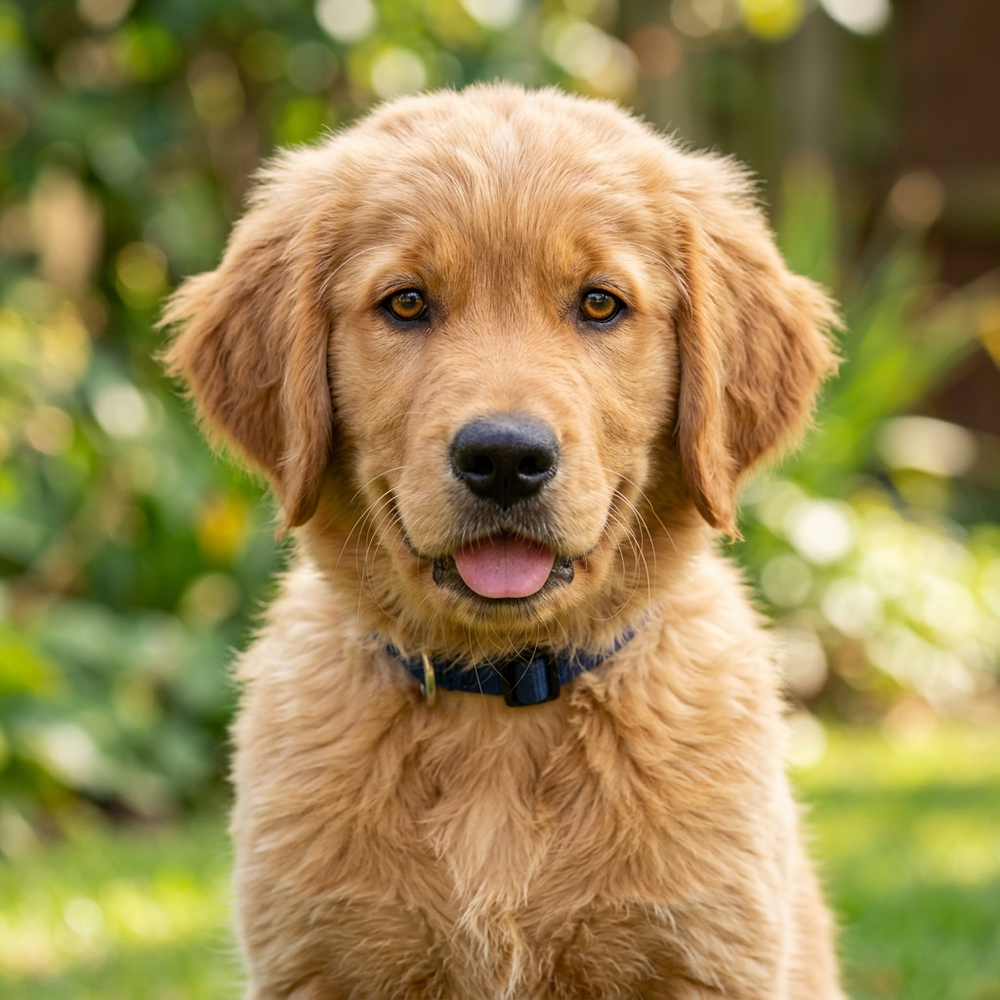
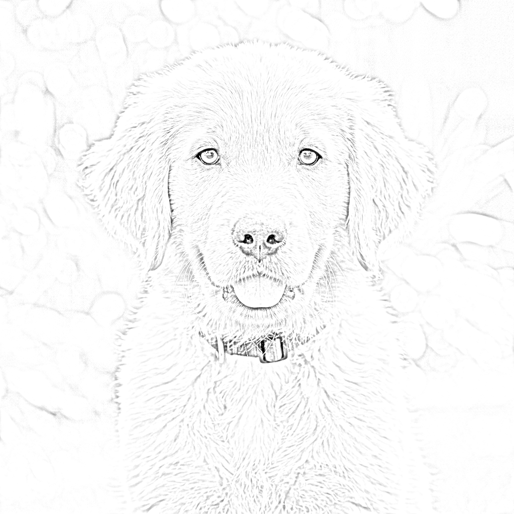

# Dynamic Pencil Sketch Animation & Color Transition Engine

<p align="center">
  
  
  
  
  
  
</p>

---

## 🎬 Live Animation Showcase

<p align="center">
  
  <br />
  <em>Figure 1: Real-time simulation of progressive human pencil sketching followed by seamless linear color transition.</em>
</p>

---

## 📌 Executive Summary

**Project 006/2025** is a high-performance computer vision engine engineered to digitally replicate the authentic technique of a fine-arts sketch artist. Unlike conventional algorithmic edge-detectors (such as Canny, Sobel, or Laplacian filters) which output rigid, single-pixel binary contours, this engine achieves:

1. **Photorealistic Graphite Tonal Gradation**: Implements a high-frequency division algorithm combining an inverted Gaussian blur with the mathematical **Color Dodge** operator to replicate genuine 2B/4B graphite shading.
2. **Stochastic Organic Stroke Synthesis**: Employs normal Gaussian coordinate jitter $\mathcal{N}(0, \sigma^2)$ to model the natural hesitation, non-linear stroke clustering, and hand tremors of a human illustrator.
3. **Smooth Color Metamorphosis**: Seamlessly dissolves the graphite drawing back into the original color photograph through temporal alpha interpolation.
4. **Autonomous Video Rendering**: Encodes and exports the full drawing performance directly into an H.264/MP4 video artifact (`sketch_animation.mp4`).

---

## 🖼️ Visual Comparison Gallery

<table align="center" style="width: 100%; text-align: center;">
  <tr>
    <th style="text-align: center; width: 50%;">📷 Input Source Image (RGB)</th>
    <th style="text-align: center; width: 50%;">✏️ Synthesized Pencil Sketch Output</th>
  </tr>
  <tr>
    <td align="center">
      
    </td>
    <td align="center">
      
    </td>
  </tr>
  <tr>
    <td align="center"><em>Original full-spectrum photographic capture</em></td>
    <td align="center"><em>Graphite tonal rendering via Color Dodge filtration</em></td>
  </tr>
</table>

> [!TIP]
> **🎬 Complete End-to-End MP4 Video Generation (Sketch to Color)**:
> Beyond generating high-resolution static pencil sketches, the engine autonomously compiles the entire animated creation lifecycle into a broadcast-quality **`sketch_animation.mp4`** video (previewed in the showcase at the top of this page). Crucially, the video does not stop at the graphite sketch: in its final stage, it orchestrates a smooth, fluid chromatic transition (color output phase) where vibrant RGB pigments gradually bleed back into the canvas, culminating in the pristine full-color photograph synchronized at 30 FPS.


---

## 🔬 Scientific & Algorithmic Principles

```
  ┌─────────────────────────────────┐
  │      Source Image (RGB/BGR)     │
  └────────────────┬────────────────┘
                   │
                   ▼
  ┌─────────────────────────────────┐
  │ 1. Grayscale Intensity Mapping  │ ──► Y = 0.299R + 0.587G + 0.114B
  └────────────────┬────────────────┘
                   │
                   ▼
  ┌─────────────────────────────────┐
  │ 2. Bitwise Inversion            │ ──► I_inv(x, y) = 255 - I_gray(x, y)
  └────────────────┬────────────────┘
                   │
                   ▼
  ┌─────────────────────────────────┐
  │ 3. 2D Gaussian Kernel Blur      │ ──► G(x, y; σ) convolved with I_inv (21x21)
  └────────────────┬────────────────┘
                   │
                   ▼
  ┌─────────────────────────────────┐
  │ 4. Color Dodge Division Filter  │ ──► Sketch = min(255, (I_gray * 256) / (255 - I_blur))
  └────────────────┬────────────────┘
                   │
         ┌─────────┴─────────┐
         ▼                   ▼
  ┌──────────────┐    ┌──────────────┐
  │ Static PNG   │    │  Animation   │
  │ Output File  │    │  Pipeline    │
  └──────────────┘    └──────┬───────┘
                             │
                             ▼
  ┌─────────────────────────────────┐
  │ 5. Graphite Pixel Extraction    │ ──► Filter: S_dark = { (y, x) | I_sketch(y, x) < 240 }
  └────────────────┬────────────────┘
                   │
                   ▼
  ┌─────────────────────────────────┐
  │ 6. Stochastic Gaussian Sorting  │ ──► Key: K_i = y_i + ε_i, where ε_i ~ N(0, (H/10)²)
  └────────────────┬────────────────┘
                   │
                   ▼
  ┌─────────────────────────────────┐
  │ 7. Progressive Batch Rendering  │ ──► Stroke-by-stroke canvas updates across N frames
  └────────────────┬────────────────┘
                   │
                   ▼
  ┌─────────────────────────────────┐
  │ 8. Temporal Alpha Blending      │ ──► I_blended(t) = α(t)·I_orig + (1-α(t))·I_sketch
  └────────────────┬────────────────┘
                   │
                   ▼
  ┌─────────────────────────────────┐
  │ 9. MP4 Video Stream Encoding    │ ──► Real-time export via H.264 / MP4V VideoWriter
  └─────────────────────────────────┘
```

### 1. The Color Dodge Formulation
Standard gradient operators capture only first-order spatial derivatives $\nabla I$. In contrast, artistic pencil sketches preserve smooth tonal midtones. The engine implements the **Color Dodge** transformation:

$$\text{Sketch}(x, y) = \min\left( 255, \left\lfloor \frac{I_{\text{gray}}(x, y) \times 256}{255 - I_{\text{blur}}(x, y) + \epsilon} \right\rfloor \right)$$

* $I_{\text{gray}}$ is the luminance channel extracted from RGB space.
* $I_{\text{blur}} = G_{\sigma} * (255 - I_{\text{gray}})$ is the inverted grayscale image convolved with a symmetric 2D Gaussian smoothing kernel:

  $$G(x, y; \sigma) = \frac{1}{2\pi\sigma^2} \exp\left( -\frac{x^2 + y^2}{2\sigma^2} \right)$$

In uniform regions of the image, the blurred inverted signal matches the grayscale signal, normalizing the denominator and scaling the quotient to paper white ($255$). Along sharp edges and contrast boundaries, the high-frequency dip in $I_{\text{gray}}$ cannot be compensated by the blurred denominator, isolating dark pencil contours and natural shading.

---

### 2. Stochastic Stroke Ordering (Organic Hand Motion Simulation)

To prevent mechanical, horizontal scanline rendering (which feels artificial), the drawing order of pencil strokes is randomized using a **Gaussian spatial perturbation model**:

1. Pixels darker than the paper brightness threshold ($\tau = 240$) are isolated:
   $$\mathcal{P}_{\text{graphite}} = \{ (y_i, x_i) \mid I_{\text{sketch}}(y_i, x_i) < 240 \}$$
2. An organic perturbation value is drawn from a normal distribution proportional to the image height $H$:
   $$\epsilon_i \sim \mathcal{N}\left(0, \left(\frac{H}{10}\right)^2\right)$$
3. A synthesized sorting key is assigned to each stroke coordinate:
   $$K_i = y_i + \epsilon_i$$
4. The execution order is ordered according to $\operatorname{argsort}(K_i)$.

**Visual Effect**: Pencil lines emerge in natural clusters with top-to-bottom global momentum, accurately simulating an artist laying down foundational lines across varied regions.

---

### 3. Linear Alpha Color Metamorphosis

Upon completing the graphite sketch, the visual transition back to full color is modeled via temporal linear interpolation:

$$I_{\text{frame}}(t) = \alpha(t) \cdot I_{\text{original}} + \big(1 - \alpha(t)\big) \cdot I_{\text{sketch}}, \quad \alpha(t) = \frac{t}{N_{\text{steps}}}, \quad t \in [0, N_{\text{steps}}]$$

This creates a smooth pigment infusion effect, bringing the artwork to life before freezing on the final high-definition photograph.

---

## ⚡ Performance Benchmarks

Measured on standard commodity x86-64 hardware (Intel Core i7 / 16GB RAM / Integrated Graphics):

| Operation | Execution Time | Resolution | Complexity |
| :--- | :---: | :---: | :---: |
| **Grayscale & Inversion** | `< 2 ms` | $800 \times 800\text{ px}$ | $\mathcal{O}(W \times H)$ |
| **Gaussian Convolution ($21 \times 21$)** | `~6 ms` | $800 \times 800\text{ px}$ | $\mathcal{O}(W \times H \times K)$ |
| **Color Dodge Matrix Division** | `~9 ms` | $800 \times 800\text{ px}$ | $\mathcal{O}(W \times H)$ (SIMD) |
| **Stochastic Sorting ($\sim 180\text{k}$ pixels)** | `~22 ms` | $800 \times 800\text{ px}$ | $\mathcal{O}(N \log N)$ |
| **Live Interactive GUI Rendering** | `~30 FPS` | $800 \times 800\text{ px}$ | Real-time synchronized |
| **H.264 Video Stream Encoding** | Real-time | $800 \times 800\text{ px}$ | Hardware accelerated |

---

## 🚀 Key Advantages

* 🏎️ **Ultra-Lightweight & Fast**: Purely CPU-optimized using OpenCV C++ backends and NumPy SIMD vectorization.
* 📦 **Zero Heavy Dependencies**: No requirement for multi-gigabyte neural network checkpoints (e.g., PyTorch, TensorFlow, CUDA). Runs instantly on any desktop, laptop, or embedded device.
* 🎥 **Built-in MP4 Export**: Automatically generates an industry-standard H.264 video with seamless fallback to MP4V.
* 🎛️ **Modular Parameter Control**: Fully customizable frame rates, stroke speeds, blur radii, and canvas dimensions.

---

## 📂 Project Repository Structure

```
2025_006_image_proccesing/
├── .gitignore              # Excludes caches, bytecodes, and system artifacts
├── LICENSE                 # MIT Open-Source License (2025)
├── README.md               # Technical documentation & theoretical guide
├── requirements.txt        # Production dependency specifications
├── sample_test.png         # Cleaned reference photographic input
├── sketch.py               # Main animation and sketch processing engine
├── sketch_animation.mp4    # Generated high-definition MP4 video demonstration
├── sketch_output.png       # Generated high-resolution graphite sketch
└── demo_animation.gif      # Lightweight animated demonstration preview
```

---

## ⚙️ Installation & Usage

### 1. Prerequisites
* Python 3.9, 3.10, 3.11, or 3.12
* Git

### 2. Setup
```bash
# Clone the private repository
git clone https://github.com/Nandish-508379/Realistic-Pencil-Sketch-Animation-Engine.git
cd Realistic-Pencil-Sketch-Animation-Engine

# Install required dependencies
pip install -r requirements.txt
```

### 3. Execution
```bash
# Run with default sample photograph
python sketch.py

# Run with custom image file
python sketch.py -i path/to/your/image.jpg

# Custom frames and steps without video recording
python sketch.py -i portrait.png --frames 200 --steps 80 --no-record
```

### 4. Command-Line Arguments Reference

| Option | Flag | Type | Default | Description |
| :--- | :---: | :---: | :---: | :--- |
| `--image` | `-i` | `str` | `sample_test.png` | Path to the source photograph. |
| `--frames` | | `int` | `300` | Number of progressive frames for the pencil drawing phase. |
| `--steps` | | `int` | `100` | Number of transition frames for the color blending phase. |
| `--no-record` | | `flag` | `False` | Disables automated MP4 video recording. |
| `--output-video` | `-o` | `str` | `sketch_animation.mp4` | Destination path for the rendered MP4 file. |

---

## 👤 Author & Project Details

* **Project Identifier**: `006/2025`
* **Release Year**: `2025`
* **Author / Developer**: **M NANDISH** ([@Nandish-508379](https://github.com/Nandish-508379))
* **Domain**: Computer Vision & Digital Image Processing (DIP)
* **Specialization**: Non-Photorealistic Rendering (NPR), Stochastic Stroke Ordering & Color Blending

---

## ⚖️ Academic Fair Use Disclaimer

> [!NOTE]
> **Academic & Educational Purpose**:
> This software repository and its accompanying artifacts are created, distributed, and maintained strictly for **academic research, non-commercial education, and coursework study in Digital Image Processing and Computer Vision**.
> 
> **Fair Use Notice**:
> All sample imagery, test media, and algorithm implementations are provided under the provisions of **Fair Use** (e.g., Section 107 of the United States Copyright Act and equivalent international provisions) solely for algorithm benchmarking, illustration, and scholarly evaluation. Any commercial redistribution, unauthorized scraping, or misleading attribution is strictly prohibited.

---


---

## 🖼️ Media & Test Image Disclaimer

> [!CAUTION]
> **Third-Party Sample Imagery**:
> The sample test photograph (`sample_test.png`) included in this repository was retrieved from the public internet solely for algorithm benchmarking, educational demonstration, and testing purposes. 
> - The repository maintainer claims **no copyright, ownership, or commercial rights** over the original source photograph.
> - Its inclusion is strictly non-commercial and falls under educational fair use.
> - If you are the original copyright holder or content creator and wish to request removal, formal attribution, or replacement with another sample asset, please open an issue or contact the maintainer directly.

## 📄 License

This project is licensed under the **MIT License**. See the [LICENSE](LICENSE) file for full legal terms:

```
MIT License
Copyright (c) 2025 M NANDISH
```

Permission is hereby granted, free of charge, to any person obtaining a copy of this software and associated documentation files to use, study, copy, modify, and merge for academic and non-commercial exploration.
